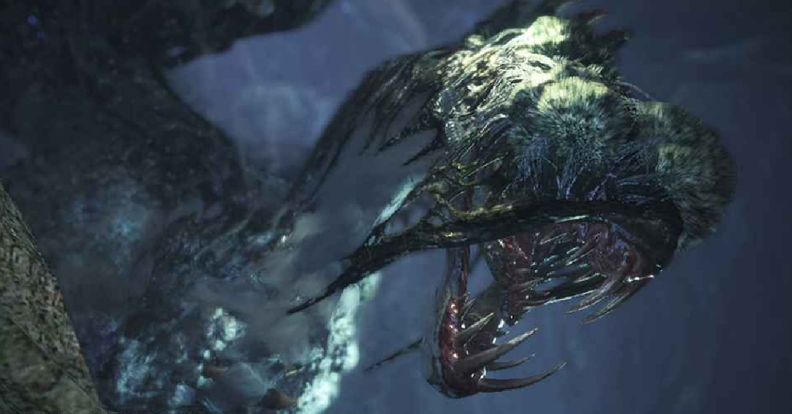

# **Blackveil Vaal Hazak**
Date: February 11th, 2020  
Category: Elder Dragons

Blackveil Vaal Hazak is a Large Monster in Monster Hunter World (MHW). 
死を纏うヴァルハザク (shi wo matou vuaruhazaku) in Japanese. It is a variant of Vaal Hazak.
    
**Found in**: Found in: Ancient Forest and Rotten Vale
**Target of Quests**: Under the Veil of Death  
**Species** : Elder Dragons  
**Elements** : ??  
**Resistances** : Water  
**Weaknesses** :  
Fire(2)         
Thunder(1)      
Dragon(2)       
Ice(1)
