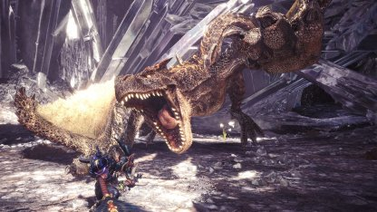

# **Brute Tigrex**
Date: January 24th, 2020
Category: Large Monsters

Brute Tigrex is a Large Monster in Monster Hunter World (MHW) that is a subspecies of Tigrex.
Brute Tigrex has blackish brown scales and a strong roar that sets this Tigrex subspecies apart.

Brute Tigrex is weak to water and thunder.

**Found in**: Only appears at Guiding Lands Rotten Level 6 and above.
**Target of Quests**: The target of quests is unkown
**Species**: Monster Class
**Elements**: None
**Resistance(s)**: Fire
**Weaknesses**:
Water (3)
Thunder (2)
Ice
Dragon
