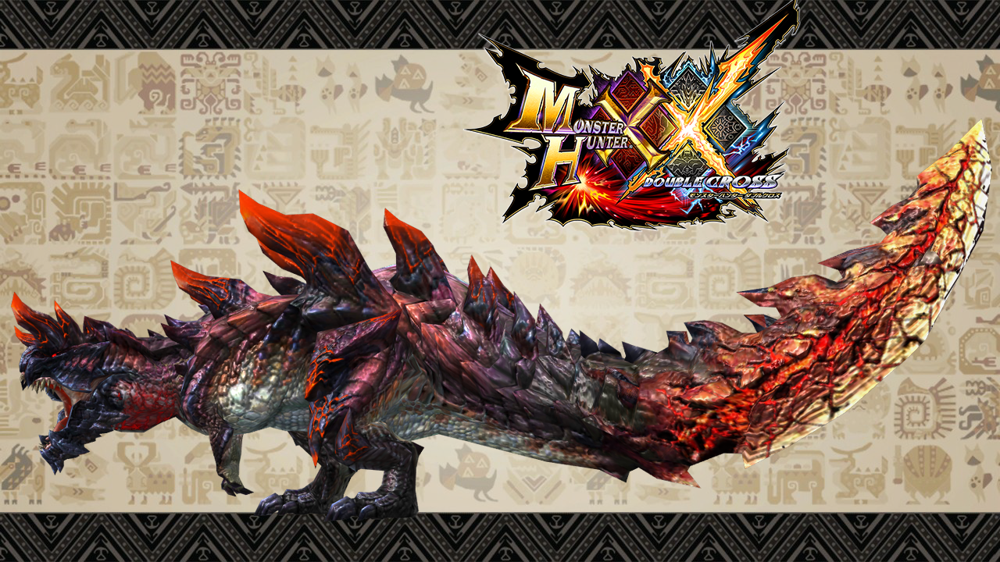

# **Glavenus**  
Date: Sept 6th, 2019  
Category: Large Monsters  

Glavenus is a Large Monster in Monster Hunter World (MHW) included in the Iceborne Expansion released on Sept 6th, 2019.  
Glavenus is a brute wyvern that weilds its heavy blue tail like a blade. It grows hotter and more keen with each strike until it grows red.
    
Glavenus is not immeadiately hostile.
    
**Found in**: Ancient Forest, Wildspire Waste, Elder's Recess     
**Target of Quests**: The Scorching Blade  
**Species**: Brute Wyverns  
**Elements**: Fire  
**Resistances**: Fire      
**Weaknesses**:
Water (3)
Ice (2)
Dragon (2)  
Thunder (1)  
