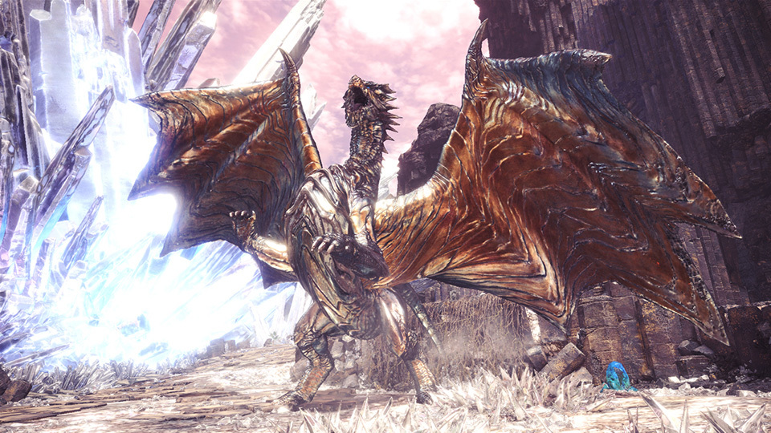

# **Kushala Daora**
Date: January 15th, 2020  
Category: Elder Dragons

Kushala Daora is a Large Monster in Monster Hunter World (MHW).
Kushala Daora is weak in the head, then the forelegs, and then the tail.

Kushala Daora is not initially hostile, and while not fighting it can you can get very close to it.
    
**Found in**: Ancient Forest, Elder's Recess
**Target of Quests**: Kushala Daora, Dragon of Steel, A Portent of Disaster, The Winds of Wrath Bite Deep, The Eye of the Storm 
**Species** : Elder Dragons  
**Elements** : None
**Resistances** : Ice, Water 
**Weaknesses** :  
Thunder (3)   
Dragon (2)
