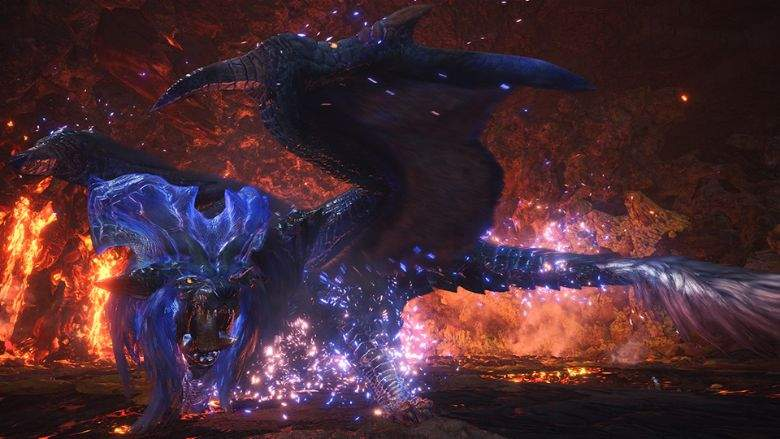

Date: January 15th, 2020
Category: Elder Dragons

Lunastra is an Elder Dragon in Monster Hunter World (MHW).
Lunastra has a resistance to fire, and is completely immune to it.

Lunastra is immediately hostile and actively attacks other monsters.

Found in: Elder's Recess, Wildspire Waste
Target of Quests: Pandora's Arena, No Remorse, No Surrender, Infernal Monarchy, Blue Prominence, 
The Thronetaker, When Blue Dust Surpasses Red Lust

Species : Elder Dragons
Elements : Fire
Resistances : Fire
Weaknesses :
Ice (3)
Dragon (2)
