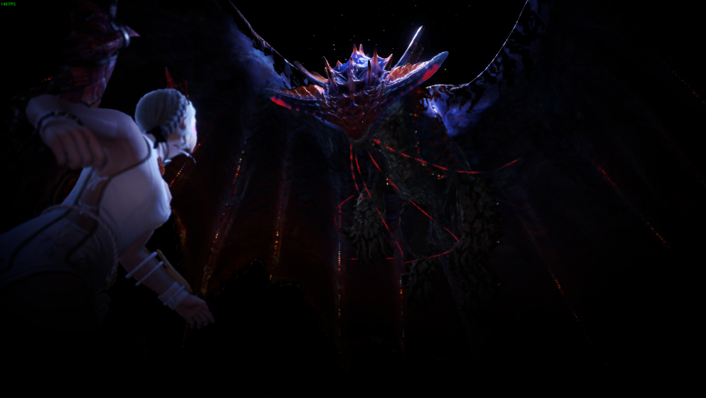

# **Namielle**
Date: January 9th, 2020  
Category: Elder Dragons

Namielle is a Large Monster in Monster Hunter World (MHW) included in the Iceborn Expansion released on Jan 9th, 2020.  
Namielle is an Elder Dragon, meaning traps such
as pitfall and shock will not be effective against her.
    
Namielle is an elder dragon said to be able to command water, using it as a shield while exploding with bright glowing lights.
    
**Found in**: Coral Highlands  
**Target of Quests**: A Light From the Abyss  
**Species** : Elder Dragons  
**Elements** : Water, Thunder  
**Resistances** : Water, Thunder  
**Weaknesses** :  
Fire (3)  
Dragon (2)  
Ice (1)
