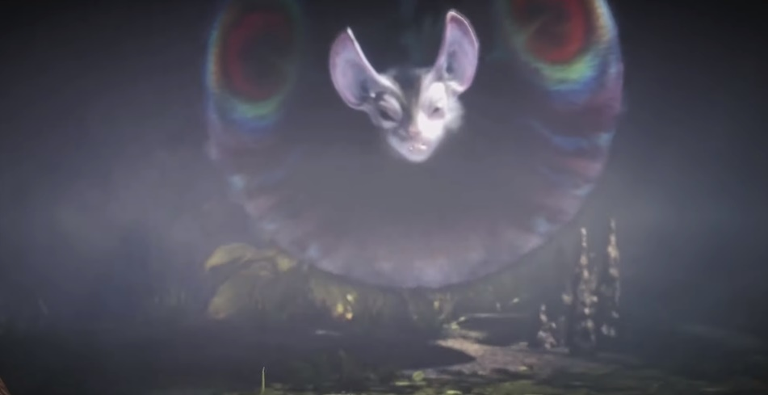

# **Nightshade Paolumu**  
Date: January 9th, 2020  
Category: Large Monsters  

Nightshade Paolumu is a Large Monster in Monster Hunter World (MHW).  

Nightshade Paolumu is a subspecies of Paolumu that is hostile only when attacked and inflicts sleep with gusts of air. 

Nightshade Paolumu is weak to water and fire.

**Found in**: Wildspire Waste, Ancient Forest  
**Elements**: Unknown  
**Resistances**: Dragon  
**Weaknesses**:   
Water (3)  
Fire (2)
Thunder (1)  
Ice (1)  
