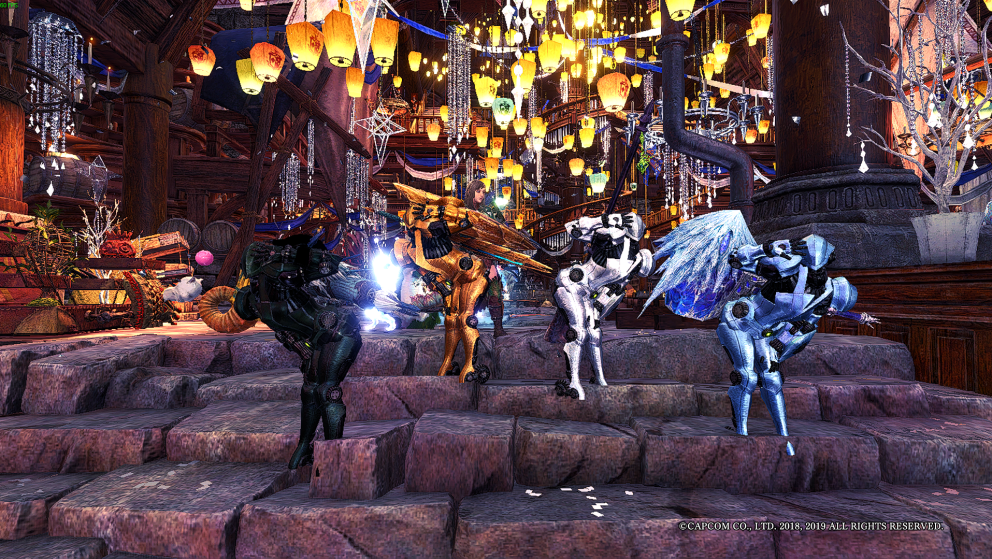

# **Monster Hunter World : Iceborne Hunter Guide**  
Date: January 28th, 2020  
Tags: monster, hunter, world, iceborne, hunter, guide  
Authors: TCMG 412 Group 1 

Welcome to the Guide for Monster Hunter World Iceborne  

Here, a guide will be provided to you about Monster Hunter World's many monsters. This guide includes monsters only introduced in the Iceborne expansion of Monster Hunter.  
  
Navigate through the lists below to find monster information.  

Enjoy your hunt!

### **Large Monsters**  
* [Banbaro](Banbaro.md)
* [Brute Tigrex](BruteTigrex.md)
* [Ebony Odogaron](Ebony.md)
* [Fulgur Anjanath](FulgurAnjanath.md)
* [Glavenus](Glavenus.md)
* [Nightshade Paolumu](NightshadePaolumu.md)
* [Zinogre](Zinogre.md)   

### **Elder Dragons**
* [Kirin](Kirin.md)
* [Kushala Daora](KushalaDaora.md)
* [Namielle](Namielle.md)
* [Ruiner Nergigante](RuinerNergigante.md)
* [Velkhana](Velkhana.md)
* [Blackveil Vaal Hazak](Blackveil.md)
  
(Pictures thanks to Alex's buddy xxxiii)
